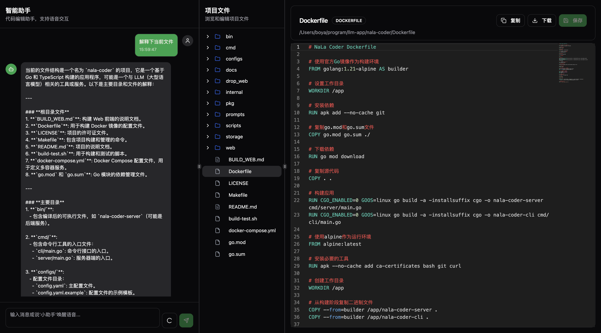

# NaLa Coder - 自然语音编程的Code Agent

基于大模型实现的对话智能编程助手，支持多种大模型调用、工具集成和智能上下文管理。



## 🌟 功能特性

- **自然语音对话**: 支持自然语音对话编程
- **提示词自定义**: 支持自定义提示词，修改prompts对应的文件即可
- **统一大模型接口**: 支持 OpenAI、DeepSeek、Claude、Ollama
- **丰富工具生态**: 文件操作、搜索发现、任务管理、系统执行等
- **智能上下文管理**: 自动压缩、持久化存储
- **灵活提示词管理**: 文件化存储，支持热更新
- **流式响应**: 支持实时流式对话
- **MCP协议支持**: 可扩展工具集成

## 📁 项目架构

```
nala-coder/
├── cmd/                    # 命令行入口
│   ├── cli/               # CLI 应用
│   └── server/            # HTTP 服务器
├── internal/               # 内部包
│   ├── agent/             # Agent核心调度层
│   ├── llm/               # 大模型调用封装
│   ├── tools/             # 工具引擎
│   ├── context/           # 上下文管理
│   └── interfaces/        # 用户交互接口
├── pkg/                   # 公共包
│   ├── types/             # 类型定义
│   └── utils/             # 工具函数
├── prompts/               # 提示词文件
├── configs/               # 配置文件
├── web/                   # Web界面
└── storage/               # 存储目录
```

## 🚀 快速开始

### 前置要求

- Go 1.21+
- 大模型API密钥（OpenAI、DeepSeek、Claude或本地Ollama）

### 安装和配置

1. **克隆项目**
```bash
git clone github.com/zboya/nala-coder
cd nala-coder
```

2. **初始化配置**
```bash
# 使用初始化脚本自动设置配置目录
./scripts/init-config.sh

# 或者手动设置
mkdir -p ~/.nala-coder/{storage,logs,prompts}
cp configs/config.yaml.example ~/.nala-coder/config.yaml
cp -r prompts/* ~/.nala-coder/prompts/
```

3. **配置API密钥**
```bash
# 编辑配置文件，设置你的API密钥
vi ~/.nala-coder/config.yaml
```

4. **运行服务**
```bash
make
```

4. **Web界面**

启动服务器后访问: http://localhost:8888
然后说“小助手”唤醒后，即可对话编程

## 🔧 配置详解

### 配置目录结构

NaLa Coder 将所有配置和数据文件统一存放在 `~/.nala-coder` 目录下：

```
~/.nala-coder/
├── config.yaml          # 主配置文件
├── storage/              # 数据存储目录
│   ├── sessions.db       # 会话数据库（SQLite）
│   └── CODE_AGENT.md     # 持久化上下文文件
├── logs/                 # 日志文件目录
│   └── nala-coder.log    # 应用日志
└── prompts/              # 提示词文件目录
    ├── en/               # 英文提示词
    │   ├── system.md     # 系统提示词
    │   ├── compression.md # 压缩提示词
    │   └── user_info.md  # 用户信息提示词
    └── ch/               # 中文提示词
        ├── system.md
        ├── compression.md
        └── user_info.md
```

### 大模型配置

支持多种大模型提供商，可以同时配置多个：

```yaml
llm:
  default_provider: "deepseek"  # 默认使用的提供商
  
  openai:
    api_key: "sk-xxx"
    base_url: "https://api.openai.com/v1"
    model: "gpt-4"
    max_tokens: 4096
    temperature: 0.3
    
  deepseek:
    api_key: "sk-xxx"
    base_url: "https://api.deepseek.com"
    model: "deepseek-chat"
    
  # 更多配置...
```

### 工具配置

可以启用/禁用特定工具：

```yaml
tools:
  enabled_tools:
    - "read"      # 文件读取
    - "write"     # 文件写入
    - "edit"      # 文件编辑
    - "bash"      # 命令执行
    # 更多工具...
  
  timeouts:
    bash: 120000    # 2分钟超时
    web_fetch: 30000 # 30秒超时
```

### 环境变量支持

可以通过环境变量覆盖配置：

```bash
export OPENAI_API_KEY="your-key"
export LLM_DEFAULT_PROVIDER="openai"
export SERVER_PORT="8888"
```

## 🛠️ 内置工具

### 文件操作工具
- **read**: 读取文件内容，支持分页
- **write**: 写入文件内容
- **edit**: 精确编辑文件特定部分
- **multi_edit**: 对同一文件进行多处编辑

### 搜索和发现工具
- **glob**: 使用模式匹配查找文件
- **grep**: 在文件内容中搜索文本模式
- **ls**: 列出目录内容

### 系统执行工具
- **bash**: 执行系统命令，支持超时控制

### 网络工具
- **web_search**: 网络搜索（需要API支持）
- **web_fetch**: 获取网页内容

## 🔧 开发指南

### 项目构建

```bash
# 构建二进制文件
make build
```

### 添加新工具

1. 在 `internal/tools/` 下创建新的工具文件
2. 实现 `ToolExecutor` 接口
3. 在 `engine.go` 中注册工具
4. 更新配置文件中的 `enabled_tools`

### 自定义提示词

1. 在 `prompts/` 目录下创建 `.md` 文件
2. 使用Go模板语法支持动态内容
3. 支持热重载，修改后立即生效

## 📊 系统架构

```ascii
                          NaLa Coder 系统架构
    ┌─────────────────────────────────────────────────────────────────┐
    │                        用户交互层                               │
    │                       ┌─────────────┐                         │
    │                       │   CLI/HTTP  │                         │
    │                       │   Interface │                         │
    │                       └─────────────┘                         │
    └─────────────┬───────────────┬───────────────┬───────────────────┘
                  │               │               │
    ┌─────────────▼───────────────▼───────────────▼───────────────────┐
    │                      Agent核心调度层                           │
    │  ┌─────────────────┐         ┌─────────────────┐               │
    │  │     主循环引擎   │◄────────┤    消息队列   │               │
    │  │  (AgentLoop)    │         │  (AsyncQueue)   │               │
    │  └─────────────────┘         └─────────────────┘               │
    └─────────────┬───────────────────────┬─────────────────────────────┘
                  │                       │
    ┌─────────────▼───────────────────────▼─────────────────────────────┐
    │                     工具执行与管理层                              │
    │ ┌────────────┐ ┌────────────┐ ┌────────────┐ ┌─────────────────┐│
    │ │   工具引擎  │ │   并发控制  │ │  LLM调用   │ │   上下文管理    ││
    │ │(ToolEngine)│ │(Scheduler) │ │ (LLMClient)│ │(ContextManager) ││
    │ └────────────┘ └────────────┘ └────────────┘ └─────────────────┘│
    └─────────────┬─────────────────────────────────────────────────────┘
                  │
    ┌─────────────▼─────────────────────────────────────────────────────┐
    │                    存储与持久化层                                │
    │ ┌─────────────┐ ┌─────────────┐ ┌─────────────┐ ┌─────────────┐ │
    │ │短期记忆存储   │ │ 中期压缩历史 │ │ 长期持久存储  │ │状态缓存系统 │ │
    │ │(Messages)   │ │(Compressed) │ │(Persistence)│ │(StateCache) │ │
    │ └─────────────┘ └─────────────┘ └─────────────┘ └─────────────┘ │
    └───────────────────────────────────────────────────────────────────┘
```

## 🤝 贡献指南

1. Fork 项目
2. 创建特性分支 (`git checkout -b feature/amazing-feature`)
3. 提交更改 (`git commit -m 'Add amazing feature'`)
4. 推送到分支 (`git push origin feature/amazing-feature`)
5. 打开 Pull Request

## 📄 许可证

本项目采用 MIT 许可证 - 查看 [LICENSE](LICENSE) 文件了解详情。

## 🆘 支持与帮助
- 查看 [Issues](https://github.com/zboya/nala-coder/issues) 获取帮助
